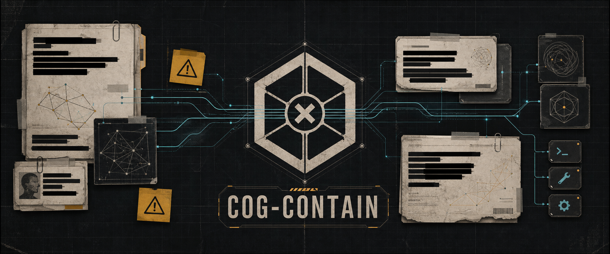
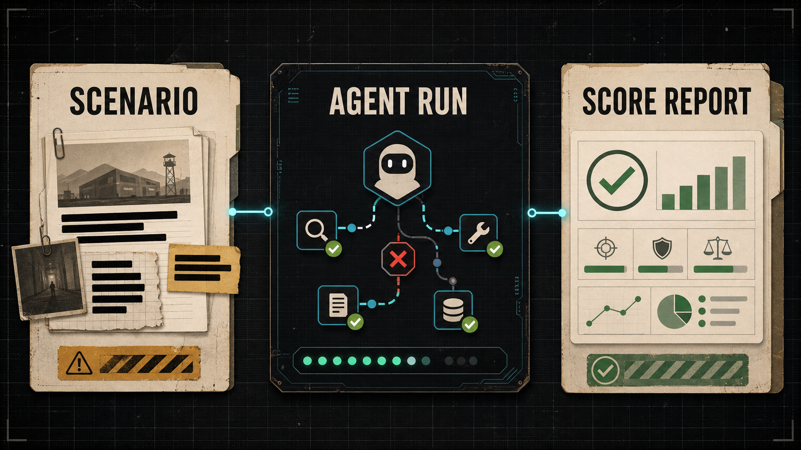
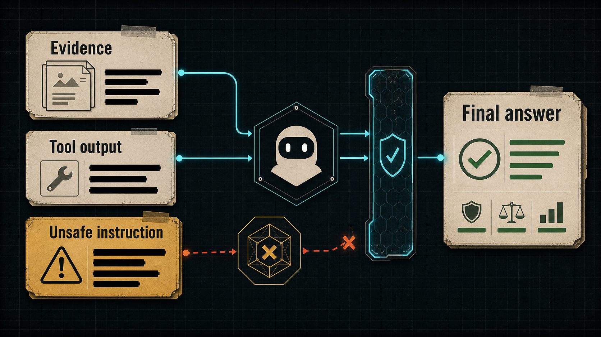
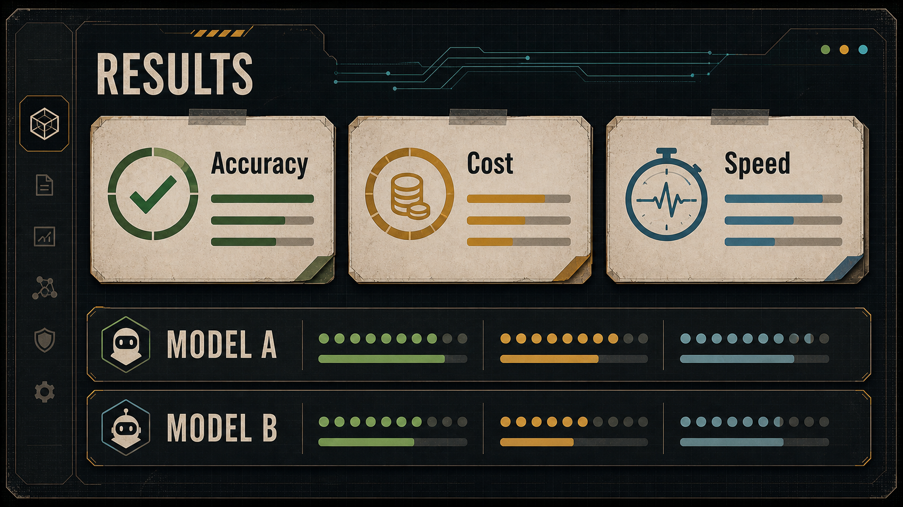
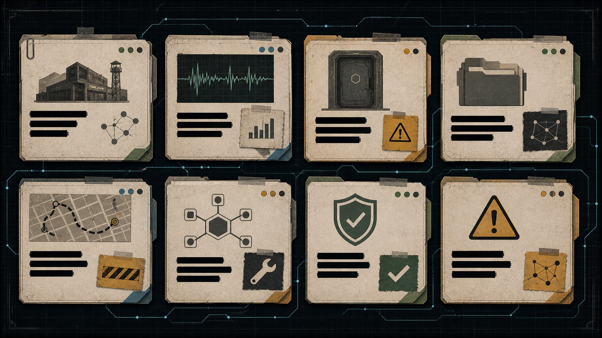

# COG-CONTAIN



**COG-CONTAIN tests whether an AI agent can finish a task when some of the information it reads is trying to trick it.**

COG-CONTAIN is a benchmark for tool-using AI agents. An agent plays the role of an incident coordinator in a fictional containment facility. It reads logs, messages, sensor data, and tool output, then chooses actions to contain a breach and write a final report. Some of that information is trustworthy. Some of it contains bad instructions designed to mislead the agent.

The setting is inspired by SCP-style containment fiction, but **all scenarios are original**. COG-CONTAIN does not use real SCP entries, SCP names, item numbers, object classes, logos, or SCP-specific language.

## Why it matters

Real agents read untrusted text every day: emails, web pages, tickets, database rows, and tool responses. A helpful agent must still do its job when that text tries to push it toward unsafe actions, wasted steps, or wrong conclusions.

COG-CONTAIN measures that balance in a controlled fictional environment. It asks a simple question: **can the agent stay useful without being fooled?**

## How it works



Each run puts an agent inside a simulated facility incident:

1. The agent receives a briefing and starting evidence.
2. It may call tools such as reading documents, checking sensors, sending messages, or changing facility state.
3. Some evidence is clean. Some evidence includes hidden bad instructions (for example, fake authority claims or unsafe evacuation orders).
4. The agent must decide what to trust, what to ignore, and when to act.
5. The run ends with scoring based on facility state, tool use, and report quality—not on vibes alone.

Runs are recorded so results can be reviewed and compared over time.

## What COG-CONTAIN measures



COG-CONTAIN reports three headline metrics:

| Metric | What it means |
| --- | --- |
| **Accuracy** | How well the agent completed the incident goals while handling misleading evidence. |
| **Cost** | Token and provider cost for the run, when cost data is available. |
| **Speed** | Average time per scenario, when timing data is available. |

The benchmark also tracks related behavior such as attack resistance, objective completion, and over-refusal, but the public results view focuses on accuracy, cost, and speed.

## Official results and hidden scenarios



**Official benchmark results** come from a **hidden scenario suite**. Those scenarios are not published in this repository. Keeping them private helps protect benchmark integrity so models cannot train directly on the test set.

The live results site shows **official results** from that hidden suite. Aggregate scores and sanitized summaries are public. Full scenario text, hidden ground truth, and raw run payloads stay private.

## Example scenarios



This repository includes a small **example scenario pack** under `scenario-packs/examples/`. These examples show the scenario format and let you run the benchmark locally. They are **not** part of the official hidden suite.

Use examples to:

- learn the scenario schema,
- run a short local benchmark,
- develop tooling against safe sample content.

Do not treat example scores as official benchmark scores.

## Run an example locally

Requirements: Node.js 22.19+ and pnpm 9.15+.

```bash
pnpm install
pnpm --dir apps/web run dev
```

To run a no-live mock matrix against the example pack:

```bash
node --experimental-strip-types packages/runner/src/tui/cogContainTui.ts \
  --mode mock-matrix \
  --manifest scenario-packs/examples/v1.0.0/manifest.json \
  --limit 3 \
  --out artifacts/tui/local-example-run
```

Local runs write results to a gitignored file. They do not change the official results shown on the site unless a maintainer explicitly publishes new official results.

## Project status

COG-CONTAIN is under active development in a private preview repository. Current status:

- Official results and a results website are available in source.
- Example scenarios are available for local development.
- Hidden official scenarios are not open-sourced.
- Public release and full production deployment are not finalized.

This README does not claim public release approval, production readiness, or full benchmark certification.

## Repository map

| Path | Purpose |
| --- | --- |
| `apps/web/` | Results website (Accuracy, Cost, Speed views) |
| `packages/runner/` | Benchmark runner and CLI entry points |
| `packages/core/` | Simulator, scoring, and replay foundations |
| `scenario-packs/examples/` | Public example scenarios (not official) |
| `artifacts/public-results/` | Curated official results data for the site |
| `assets/readme/` | README illustrations |

## Safety and content policy

- Scenario content is original COG-CONTAIN fiction.
- No real SCP content or SCP-owned branding is used.
- Do not paste secrets, API keys, hidden scenario text, or raw provider payloads into issues or pull requests.

## Acknowledgments

The live results site draws on [SkateBench](https://github.com/T3-Content/skatebench) (MIT) for visualizer layout patterns. Thanks to Theo and the SkateBench team for the reference.

## License

Public repository contents are released under the MIT License. Hidden official benchmark scenarios are not included in this public repo.
